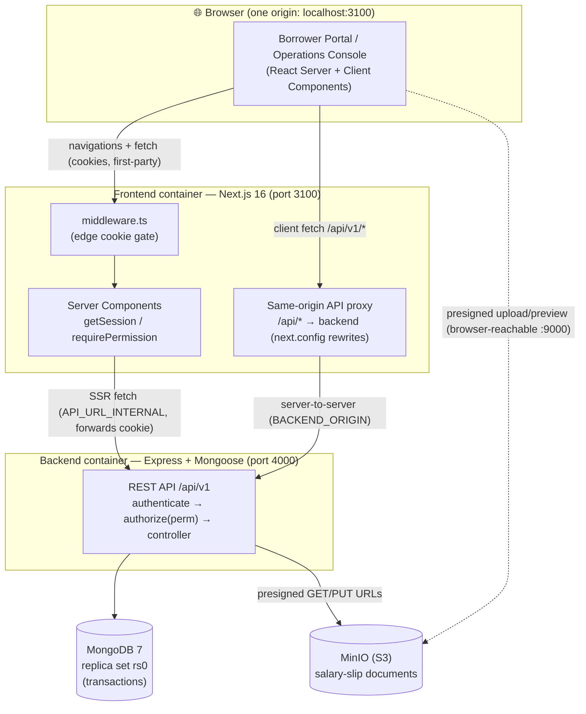
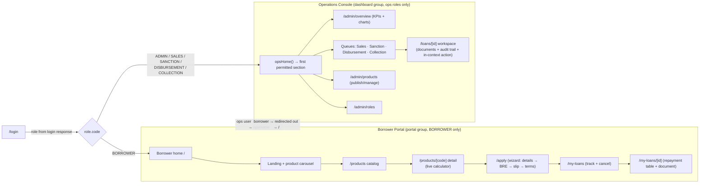
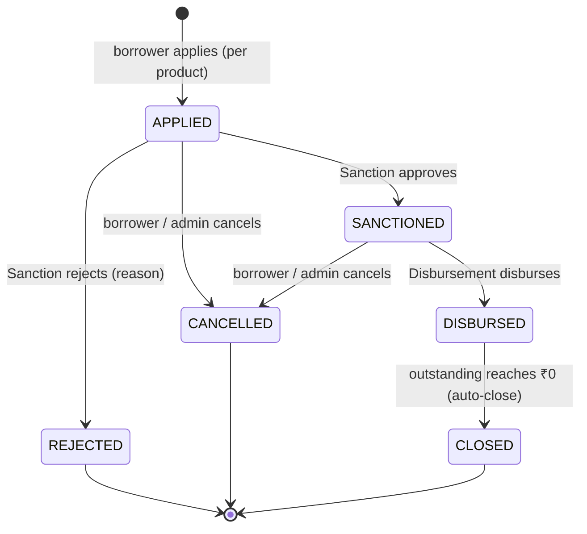
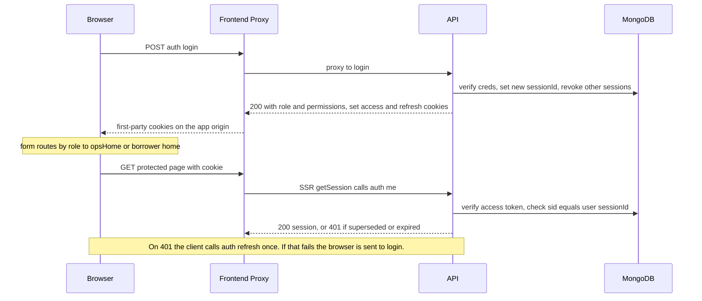
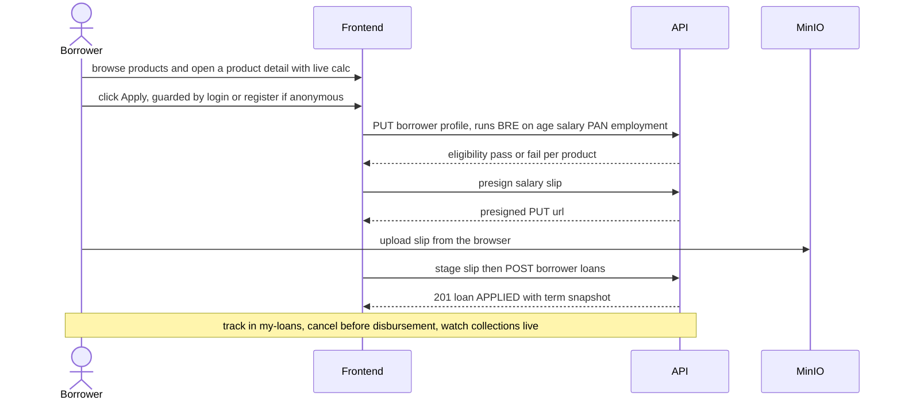

# LMS — Loan Management System

A production-style, full-stack **Loan Management System** with two cleanly separated experiences:

- **Borrower Portal** — a public marketing landing + product catalog, an online application journey (eligibility/BRE, salary-slip upload, live repayment calculator), loan tracking, cancellation, and a read-only repayment view.
- **Operations Console** — a role-guarded back-office for **Admin, Sales, Sanction, Disbursement, Collection** with work queues, a shared loan-detail workspace (documents + audit trail + in-context actions), a metrics dashboard, product publishing, and roles.

RBAC is enforced on **both** sides — server-side route guards in the frontend and `authorize(<permission>)` middleware on every protected API route. Money is handled as integer **paise** internally and **rupees** at the API edge.

> Built incrementally across four iterations (v1 core → v2 landing/registration/analytics → v3 loan products + admin dashboard → v4 portal separation, cancel, document preview, single-session auth). Per-iteration design specs and live-verification reports live in [`docs/`](docs/).

---

## High-level architecture



**Why the proxy?** The browser only ever talks to the app's own origin (`:3100/api/*`); Next.js forwards to the backend over the internal Docker network. This keeps the auth cookies **first-party to the app origin**, which is what makes server-side rendering, the edge middleware, and client fetches all see the same session reliably. (A direct cross-origin browser→`:4000` setup with `SameSite=Strict` cookies caused spurious logouts; the proxy eliminates that whole class of bug.)

### Containers (`docker-compose.yml`)

| Service | Image / build | Port | Role |
|---|---|---|---|
| `frontend` | `lms-frontend` (Next.js 16) | `3100:3000` | UI + same-origin API proxy |
| `backend` | `lms-backend` (Express/TS) | `4000:4000` | REST API `/api/v1` |
| `mongo` | mongo:7 (single-node **replica set** `rs0`) | internal | Primary datastore + transactions |
| `minio` | minio/minio | `9000` (API), `9001` (console) | Object storage for documents |
| `seed` | one-shot (backend image) | — | Upserts permissions, roles, users, products |
| `createbucket` | one-shot (mc) | — | Creates the MinIO bucket |

---

## Tech stack

**Backend** — Node 20, Express 4, TypeScript 5 (strict), Mongoose 8, MongoDB 7, zod 3, JWT (`jsonwebtoken`) + bcrypt (+ pepper), `helmet`, `express-rate-limit`, `pino`, AWS SDK v3 S3 (MinIO), `svg-captcha`. Tests: Jest + ts-jest + supertest + `mongodb-memory-server` (ReplSet).

**Frontend** — Next.js 16 (App Router; async `cookies()`/`params`/`searchParams`), React 19, TypeScript strict, Tailwind, **shadcn-on-@base-ui** (no `asChild`; Slider takes an array value; Dialog uses the `render` prop), `lucide-react`, `sonner`, **Recharts**, `react-hook-form` + zod. Tests: Vitest + React Testing Library.

**Tooling** — **Bun** (`bun install` / `bun add` / `bun run <script>`), Docker Compose.

---

## Repository layout

```
LMS/
├── lms-backend/        # Express + Mongoose API (own git repo)
│   └── src/
│       ├── models/             # Mongoose schemas (barrel: models/index.ts)
│       ├── modules/            # auth, borrower, loans, payments, leads,
│       │                       #   products, metrics, rbac, public, analytics
│       ├── middleware/         # authenticate, authorize, validate, error-handler
│       ├── lib/                # jwt, password, money, loan-math, bre, storage, errors, captcha
│       └── seed/               # definitions/ (permissions, roles, users, products) + seed.ts
├── lms-frontend/       # Next.js 16 app (own git repo)
│   └── src/
│       ├── app/
│       │   ├── (auth)/         # login, signup
│       │   ├── (marketing)/    # public landing, /products, /products/[code]
│       │   ├── (portal)/       # borrower-only: /apply, /my-loans, /my-loans/[id]
│       │   └── (dashboard)/    # ops-only: /sales /sanction /disbursement /collection
│       │                       #   /loans/[id] /admin/{overview,loans,products,roles}
│       ├── components/         # ui/ (base-ui), dashboard/, marketing/, products/, wizard/, common/
│       ├── lib/                # api/ (client + endpoints), auth/ (session, ops-home), money, loan-calc
│       └── middleware.ts       # edge cookie gate + same-origin proxy marker
├── docker-compose.yml  # all services
├── .env                # secrets + URLs (gitignored; see .env.example)
└── docs/               # design specs + live-verification reports (v1–v4)
```

---

## The two portals



- **Cross-portal gating** runs in each route group's layout: a borrower hitting an ops URL is sent to `/`; an ops user hitting a borrower URL is sent to their `opsHome`.
- **Operations queues** are filtered views of the loan lifecycle. Every row opens the **shared loan-detail workspace** where the work actually happens — document preview/download, the full audit trail, and the section's action (Approve/Reject, Disburse, or Record Collection), available from both the table row and the detail.

---

## Loan lifecycle (state machine)



- Transitions are enforced by a **state machine** (`nextStatus(current, action)`); illegal transitions throw `409 Conflict`.
- **Cancel** is allowed only before disbursement (`APPLIED` / `SANCTIONED`). A `CANCELLED` loan is not "active", so the borrower may **re-apply** for the same product.
- **Collection** records partial payments (rupees in); each payment reduces `outstanding`; the loan **auto-closes** when outstanding hits zero. Payments are tracked once and shown on both the ops and borrower sides (borrower view omits staff identity).
- Each loan carries a **term snapshot** (rate/code/name frozen at apply time) and a full **audit trail** (`statusHistory` + sanction/disbursement/cancellation actors + payments), assembled at read time.

---

## Authentication & session flow

JWT auth with **httpOnly cookies**: a short-lived access token (15m) + a rotating refresh token (7d, single-use, hashed at rest). A **single active session per user** is enforced — a `sessionId` is stamped into the tokens and checked on every request, so logging in again invalidates the previous session immediately.



- The credential/refresh endpoints are rate-limited (50 / 15 min); `/auth/me` and `/auth/captcha` are **not** (they're hit on every page).
- Registration adds first/last name, IN `+91` phone, password + confirm, and an **SVG captcha** (one-time, hashed, TTL).

---

## RBAC — roles × permissions

Permissions, roles, and a static set of users are **seeded idempotently** (upsert-by-code; admin edits are preserved on re-seed).

| Permission | ADMIN | SALES | SANCTION | DISBURSEMENT | COLLECTION | BORROWER |
|---|:--:|:--:|:--:|:--:|:--:|:--:|
| `lead:read` | ✓ | ✓ | | | | |
| `loan:read:all` | ✓ | | ✓ | ✓ | ✓ | |
| `loan:sanction` | ✓ | | ✓ | | | |
| `loan:disburse` | ✓ | | | ✓ | | |
| `payment:create` | ✓ | | | | ✓ | |
| `payment:read` | ✓ | | ✓ | ✓ | ✓ | |
| `product:read` | ✓ | ✓ | ✓ | ✓ | ✓ | |
| `product:manage` | ✓ | | | | | |
| `metrics:read` | ✓ | | | | | |
| `rbac:read` | ✓ | | | | | |
| `loan:apply` | | | | | | ✓ |
| `loan:read:own` | | | | | | ✓ |
| `loan:cancel` | ✓ | | | | | ✓ |

Enforced by `authenticate` (resolves the user + its permission set) → `authorize(<perm>)` on the route. The frontend mirrors this with `requirePermission` (server) and permission-filtered navigation.

---

## Loan products & money model

Admins **publish loan products** (offerings) that borrowers browse and apply against:

| Field | Notes |
|---|---|
| `code`, `name`, `category`, `description` | identity + display |
| `interestRate` | % per annum — **per product** |
| `minPrincipal` / `maxPrincipal` | bounds (paise internally, rupees at the edge) |
| `minTenureDays` / `maxTenureDays` | tenure bounds |
| `eligibility` | `{ minAge, maxAge, minMonthlySalary, employmentModes[] }` |
| `status` | `ACTIVE` / `INACTIVE` (borrowers see only ACTIVE) |

Seeded catalog: **Personal Loan** (12% p.a., ₹50k–₹5L, 30–365d) and **Salary Advance** (18% p.a., ₹10k–₹1L, 7–60d).

**Money discipline**
- DB + all internal math use **integer paise**. APIs accept/return **rupees** and convert at the edge (`rupeesToPaise` / `paiseToRupees`).
- Frontend: `formatRupees(paise)` divides by 100; `formatRupeesAmount(rupees)` formats directly. Loan fields (principal/outstanding/totalRepayment) are paise; product/metrics/payment amounts are rupees.
- Repayment = simple interest: `interest = principal × rate × tenureDays / (365 × 100)`.

---

## API surface (selected)

Base path: **`/api/v1`**.

| Area | Endpoints |
|---|---|
| **Auth** | `POST /auth/signup`, `POST /auth/login` (→ role), `POST /auth/refresh`, `POST /auth/logout`, `GET /auth/me`, `GET /auth/captcha` |
| **Public** | `GET /public/products`, `GET /public/config` |
| **Borrower** | `PUT /borrower/profile`, salary-slip presign/stage, `POST /borrower/loans` (apply), `GET /borrower/loans`, `GET /borrower/loans/:id` (→ `{loan, payments}`), `POST /borrower/loans/:id/cancel`, `GET /borrower/loans/:id/document` |
| **Products** | `GET /products`, `GET /products/:code`, `POST /admin/products`, `PATCH /admin/products/:id`, activate/deactivate |
| **Loans (ops)** | `GET /loans` (filter/search/sort), `GET /loans/:id` (→ `{loan, payments, timeline}`), `POST /loans/:id/{sanction,reject,disburse,cancel}`, `GET /loans/:id/document`, `…/payments` |
| **Leads (sales)** | `GET /leads?stage=…` (funnel stages incl. drop-offs), mark-contacted |
| **Metrics** | `GET /admin/metrics` (KPIs, funnel, by-status, by-product, 12-month series) |
| **RBAC / misc** | `GET /admin/roles`, `POST /track` (analytics) |

---

## Borrower journey (sequence)



---

## Running locally

**Prerequisites:** Docker Desktop. (For running tests outside Docker: Bun + Node 20.)

```bash
# 1) from the repo root
cp .env.example .env            # adjust secrets if you like

# 2) build + start everything
docker compose up -d --build

# 3) seed permissions, roles, users, products (idempotent)
docker compose run --rm seed
```

Then open **http://localhost:3100**.

- Borrower portal: the public landing; log in or sign up as a borrower.
- Operations console: log in with a staff account — you're routed straight to your section.
- MinIO console (optional): http://localhost:9001.

> **Tip:** auth cookies are first-party to `:3100`. If you previously tested an older build, clear `localhost` cookies (or use a fresh profile) before logging in.

### Seeded credentials (demo / local only)

| Role | Email | Password | Lands on |
|---|---|---|---|
| Admin | `admin@lms.test` | `Admin@123` | `/admin/overview` |
| Sales | `sales@lms.test` | `Sales@123` | `/sales` |
| Sanction | `sanction@lms.test` | `Sanction@123` | `/sanction` |
| Disbursement | `disbursement@lms.test` | `Disburse@123` | `/disbursement` |
| Collection | `collection@lms.test` | `Collect@123` | `/collection` |
| Borrower | `borrower@lms.test` | `Borrow@123` | `/` |

---

## Environment variables (key ones)

| Variable | Where | Purpose |
|---|---|---|
| `JWT_ACCESS_SECRET` / `JWT_REFRESH_SECRET` | backend | token signing (≥32 chars) |
| `JWT_ACCESS_TTL` / `JWT_REFRESH_TTL` | backend | token lifetimes (default `15m` / `7d`) |
| `COOKIE_SECURE` / `COOKIE_DOMAIN` | backend | cookie flags (`false` for http localhost) |
| `CORS_ORIGIN` | backend | allowed browser origin |
| `MONGO_URI` | backend | replica-set connection string |
| `MINIO_*` / `MINIO_PUBLIC_ENDPOINT` | backend | object storage + browser-reachable presign host |
| `NEXT_PUBLIC_API_URL` | frontend (build) | browser API base — **`/api/v1`** (same-origin) |
| `API_URL_INTERNAL` | frontend (runtime) | SSR → backend (`http://backend:4000/api/v1`) |
| `BACKEND_ORIGIN` | frontend (**build** arg) | proxy target baked into `next.config` rewrites |

---

## Testing

```bash
# backend (from lms-backend/)  — Jest + in-memory Mongo replica set
bun run test

# frontend (from lms-frontend/) — Vitest + RTL
bun run test
```

Current status: **backend ≈186 tests / 51 suites**, **frontend ≈123 tests**, both green. Each feature was built test-first and reviewed; end-to-end flows were verified against the running Docker stack (see [`docs/v3-live-verification.md`](docs/v3-live-verification.md), [`docs/v4-live-verification.md`](docs/v4-live-verification.md)).

---

## Feature evolution

| Version | Highlights | Spec |
|---|---|---|
| **v1** | Core LMS: RBAC, borrower apply (BRE + slip), loan lifecycle, payments/auto-close, connection pooling, Docker | [`docs/superpowers/specs/2026-06-25-lms-design.md`](docs/superpowers/specs/2026-06-25-lms-design.md) |
| **v2** | Marketing landing, richer registration + **captcha**, background **analytics**, one-application-per-borrower, UI uplift | [`…-lms-product-v2-design.md`](docs/superpowers/specs/2026-06-25-lms-product-v2-design.md) |
| **v3** | **Loan products** (admin-published catalog) + per-product apply/eligibility + term snapshot; **admin dashboard** (KPIs, charts, filterable loans, audit trail) | [`…-lms-product-v3-design.md`](docs/superpowers/specs/2026-06-25-lms-product-v3-design.md) |
| **v4** | **Two-portal** separation + role-routed login; product **detail page** + live calc; **cancel** loan; **repayment view**; **document preview/download**; collapsible ops nav + **loan workspace**; **leads funnel**; **single-session** auth + same-origin proxy | [`…-lms-v4-portals-design.md`](docs/superpowers/specs/2026-06-26-lms-v4-portals-design.md) |

---

## Notable design decisions

- **Same-origin API proxy** keeps auth cookies first-party — the reliable way to combine Next.js SSR with cookie auth across a separate API.
- **Single active session** (sessionId in tokens) — a new login invalidates the previous session immediately. *(Note: because cookies are shared across a browser's tabs, this also means one browser = one logged-in user at a time.)*
- **Integer paise** end-to-end with explicit rupee/paise boundaries — avoids floating-point money bugs.
- **Audit trail derived at read time** from `statusHistory` + sub-docs + payments — no separate event store.
- **Idempotent seed** (upsert-by-code) so re-seeding never clobbers admin-edited products/roles.
- **Term snapshot on the loan** so editing a product never retroactively changes existing loans.
